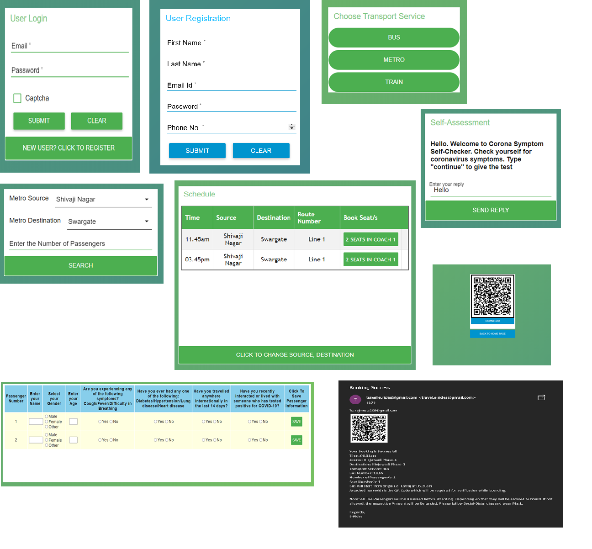

# Intelligent Post Lock-Down Management System for Public Transportation

The Post-Lockdown, it will be difficult and risky to allow public transportation without any safety measures. There must be a proper mechanism to maintain social distancing and manage the frequency of public transport services. 
Thus, there is a need for an application that will schedule the timing of transportation, avoid over-occupancy, and maintain social distancing. 
There is a certain insecurity among people to use public transport nowadays. This app will assist users, assure and make them aware too. 
The following points will be considered during app development: 
●	Contact-less ticketing options like passes or digital payments 
●	Avoid over-occupancy of transport services 
●	Maintain social distancing by allocating distant seats to users 
●	Safety check whenever the user books a ride 
●	Proper guidelines about sanitation, mask while boarding 
●	Verification of booking at the time of boarding 
Software Requirements: : IBM Cloud, Node Red, Watson Assistant, Cloudant Service

## Video Demonstration 
<html><body>
<a href="https://drive.google.com/file/d/1m9DzNNO51MobywQ7OakuSo-ADvqNy0Wv/view?usp=sharing">Click Here To Watch The Video Demonstration</a>  

</body></html>
  
## Flow
The web-app has Node-RED for the User Interface development. The web-app has been deployed on IBM Cloud. Basic Flow is as follows:
<html><body></body></html>

## Watson Assistant Skill
The JSON Code for the skill is available <html><body><a href="Watson Assistant Skill/symptom-checker-bot.json">HERE</a>.  
</body></html>

## Node-RED Flow
The JSON Code for Node-RED Flow is available <html><body><a href="Node-RED Flow/arceus-flow.json">HERE</a>.  
</body></html>

## Cloudant DB
The databases used are available <html><body><a href="Cloudant Databases/">HERE</a>.  
</body></html>

## Applications
The following can be the Applications:<html><body>  
App can be used to book bus, train as well as metro tickets. So, there is no explicit need to visit other websites for booking different modes of transport. The app comes with an easy drop-down source and destination list with an additional option of choosing the number of passengers, which makes it easy to use. 
 
The App comes with an inbuilt symptom checker which can be integrated with other apps to ensure the safety of all passengers. This will help other services to book rides without the risk of drivers getting affected by referring to Ola, Uber where social distancing is a challenge. This will be convenient for the passengers and the drivers as well.
 </body></html>

## Conclusion
The web-app has been built that will cater the needs of customers using public transport and avoid over-occupancy, follow social distancing criteria which will be beneficial in the current pandemic situation. The web-app is available <html><body><a href="https://node-red-arceus.eu-gb.mybluemix.net/ui/">HERE</a></body></html>.
There still can be more improvements in the model like creating a Mobile App instead of a web-app, and some other features.
<html><body></body></html>

## Future Scope
The future Scope of this app can be by adding the following to make it more advanced:<html><body>  
1) Check the user temperature with infrared sensors: 
 In the current version of the app a symptom checker is used to identify the scale of risk at which the user is for Covid19. If the user is found out to be at a high risk, he/she will not be able to proceed for ticket booking. This symptom checker is developed using Watson assistant service. However, the con of this is that the user can give wrong answers to bypass the checker and continue with the booking. To avoid such a situation, infrared sensors can be used. These sensors will determine the user temperature and accordingly inform if the user is at a high risk for Corona or not.    

2) Expanding the database:  
The current cloudant database contains of 30 unique bus routes with their timings. The user can book tickets only for these routes. The database can be expanded and more bus routes will be available for the user to book. Besides this the frequency of buses can also be increased. This will lead to more number of users.  

3) Use of piezo-electric sensors: 
 The main objective of this project is to maintain social distancing and minimize the risk of the communal spread of the corona virus. Hence those seats are allocated to the users which are at a safe distance from each other. However, the risk here is that the user ignores the allocated seat in his ticket and sits on another one. To avoid this piezo-electric sensor can be placed on the unallocated seats. If any passenger sits on these seats, the sensor can trigger an alarm. This will help in maintaining social distancing between the passengers.    
 </body></html>
